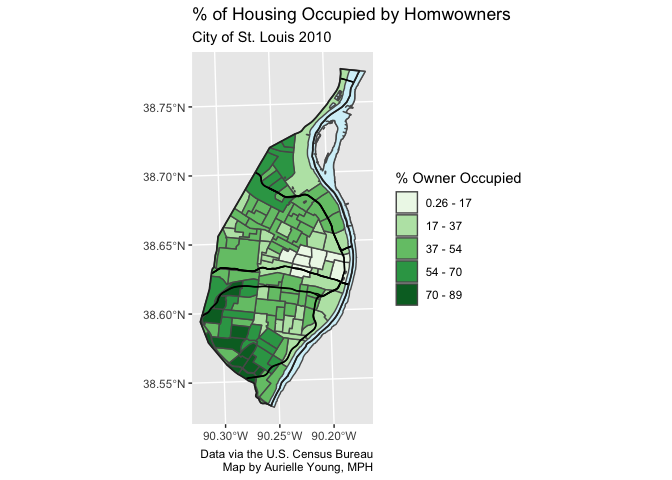

lab 03
================
Aurielle Young, MPH
(February 21, 2021)

## Introduction

This notebook provides completed code for lab 03.

## Dependencies

This notebook requires the following packages to complete the
assignment:

``` r
# tidyverse packages
library(ggplot2)      # statis mapping

# spatial packages
library(mapview)      # preview spatial data
```

    ## GDAL version >= 3.1.0 | setting mapviewOptions(fgb = TRUE)

``` r
library(sf)           # spatial tooks
```

    ## Linking to GEOS 3.8.1, GDAL 3.1.4, PROJ 6.3.1

``` r
# other packages
library(here)         # file path management 
```

    ## here() starts at /Users/AuriYoung/Documents/GitHub/YoungAssignments/lab 03

``` r
library(RColorBrewer) # color brewer palettes
```

## Load Data

We will load a custom function:

``` r
source(here("source", "map_breaks.R"))
```

We are going to use `map_breaks` function.

A description of what your code should accomplish. This notebook
requires the following data from the `data/` folder.

``` r
# city boundary
stl_boundary <- st_read(here("data", "STL_BOUNDARY_City.geojson"))
```

    ## Reading layer `STL_BOUNDARY_City' from data source `/Users/AuriYoung/Documents/GitHub/YoungAssignments/lab 03/data/STL_BOUNDARY_City.geojson' using driver `GeoJSON'
    ## Simple feature collection with 1 feature and 2 fields
    ## geometry type:  MULTIPOLYGON
    ## dimension:      XY
    ## bbox:           xmin: 733360 ymin: 4268394 xmax: 746157.1 ymax: 4295511
    ## projected CRS:  NAD83 / UTM zone 15N

``` r
# water layers
il_hydro <- st_read(here("data", "IL_HYDRO_Mississippi.geojson"))
```

    ## Reading layer `IL_HYDRO_Mississippi' from data source `/Users/AuriYoung/Documents/GitHub/YoungAssignments/lab 03/data/IL_HYDRO_Mississippi.geojson' using driver `GeoJSON'
    ## Simple feature collection with 4 features and 8 fields
    ## geometry type:  POLYGON
    ## dimension:      XY
    ## bbox:           xmin: 739063 ymin: 4268279 xmax: 746617.9 ymax: 4295339
    ## projected CRS:  NAD83 / UTM zone 15N

``` r
stl_hydro <- st_read(here("data", "STL_HYDRO_AreaWater.geojson"))
```

    ## Reading layer `STL_HYDRO_AreaWater' from data source `/Users/AuriYoung/Documents/GitHub/YoungAssignments/lab 03/data/STL_HYDRO_AreaWater.geojson' using driver `GeoJSON'
    ## Simple feature collection with 16 features and 2 fields
    ## geometry type:  POLYGON
    ## dimension:      XY
    ## bbox:           xmin: 733468.5 ymin: 4268394 xmax: 746157.1 ymax: 4295418
    ## projected CRS:  NAD83 / UTM zone 15N

``` r
# highways
highways <- st_read(here("data", "STL_TRANS_PrimaryRoads"))
```

    ## Reading layer `STL_TRANS_PrimaryRoads' from data source `/Users/AuriYoung/Documents/GitHub/YoungAssignments/lab 03/data/STL_TRANS_PrimaryRoads' using driver `ESRI Shapefile'
    ## Simple feature collection with 9 features and 4 fields
    ## geometry type:  MULTILINESTRING
    ## dimension:      XY
    ## bbox:           xmin: 733482 ymin: 4270554 xmax: 745666.9 ymax: 4294751
    ## projected CRS:  NAD83 / UTM zone 15N

``` r
# owner occupied housing
housing <- st_read(here("data", "STL_HOUSING_OwnerOccupied.geojson"))
```

    ## Reading layer `STL_HOUSING_OwnerOccupied' from data source `/Users/AuriYoung/Documents/GitHub/YoungAssignments/lab 03/data/STL_HOUSING_OwnerOccupied.geojson' using driver `GeoJSON'
    ## Simple feature collection with 106 features and 5 fields
    ## geometry type:  MULTIPOLYGON
    ## dimension:      XY
    ## bbox:           xmin: 733360 ymin: 4268410 xmax: 746170.8 ymax: 4295511
    ## projected CRS:  NAD83 / UTM zone 15N

## Part 1

The `mapview()` was used to explore the data. All layers are polygon
data except for the highways which are line data.

## Part 2

The following code is used to create the map breaks using the `fisher`
approach and then adds layers for the water features and highway to our
census track data for owner occupied housing.

``` r
## create breaks
housing <- map_breaks(housing, var = "pct_owner_occupied", newvar = "map_breaks",
                      style = "fisher", classes = 5, dig_lab = 2)

## map binned data
p1 <- ggplot() +
  geom_sf(data = stl_boundary, fill = "#ffffff", color = NA) +
  geom_sf(data = housing, mapping = aes(fill = map_breaks)) +
  geom_sf(data = il_hydro, fill = "#d4f1f9") +
  geom_sf(data = stl_hydro, fill = "#d4f1f9") +
  geom_sf(data = highways, color = "#000000") +
  geom_sf(data = stl_boundary, fill = NA, color = "#2a2a2a", size = .6) +
  scale_fill_brewer(palette =  "Greens", name = "% Owner Occupied") +
  labs(
      title = "% of Housing Occupied by Homwowners",
      subtitle = "City of St. Louis 2010",
      caption = "Data via the U.S. Census Bureau\nMap by Aurielle Young, MPH"
  )
  
p1
```

<!-- -->

Map shows that rates of ownership are highest in the southwest portion
of St. Louis.

Will save the map using code:

``` r
ggsave(plot = p1, filename = here("results", "owner_occupied_housing.png"))
```

    ## Saving 7 x 5 in image

The map is now saved!
